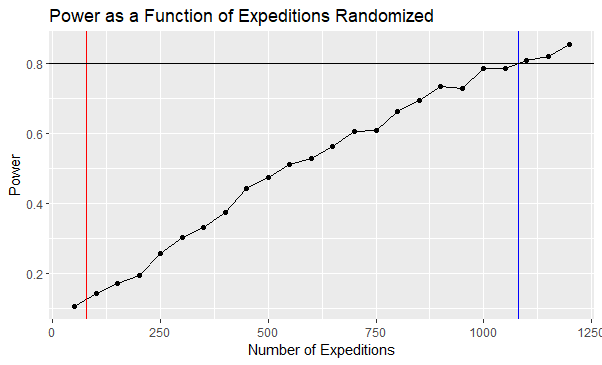

```{r setup, include=FALSE}
knitr::opts_chunk$set(echo = FALSE, include = TRUE, warning = FALSE, message = FALSE, fig.width = 5, fig.height = 3.3, fig.align = "center", fig.pos = "p")
```

```{r, echo=FALSE, include=FALSE}

# Install packages
# install.packages(c("survival", "survminer", "dplyr", "lme4", "ggplot2", "tidyverse", "stats4", "readr"))

# Load libraries
library(dplyr)
library(lme4)
library(ggplot2)
library(fitdistrplus)
library(tidyverse)
library(stats4)
select <- dplyr::select
library(survival)
library(readr)
library(survminer)

```

```{r, echo=FALSE, include=FALSE}

### READ IN DATA ### 

df <- climbers_full <- read_csv("climbers_full.csv")

```

```{r, echo=FALSE, include=FALSE}

### DATA CLEANING ###

# Change various parts of dataframe based off exploratory analyses 
climbers_full <- climbers_full %>%
  dplyr::mutate(calcage = ifelse(calcage == 0, NA, calcage), 
                mperhighpt = ifelse(mperhighpt == 0, NA, mperhighpt),
                mperhighpt = ifelse(mperhighpt > 8167 & peakid == "DHA1", 8167, mperhighpt),
                mperhighpt = ifelse(mperhighpt > 8849 & peakid == "EVER", 8849, mperhighpt),
                deathtype = ifelse(deathtype == 0, NA, deathtype), 
                injurytype = ifelse(injurytype == 0, NA, injurytype))

climbers_full$deathtype <- climbers_full$deathtype %>%
  factor(levels = c(1, 2, 3, 4, 5, 6, 7, 8, 9, 10, 11, 12), 
         labels=c("AMS", "Exhaustion", "Exposure", "Fall", "Crevasse", "Icefall", "Avalanche", "Falling Rock/Ice", "Disappearance", "Illness", "Other", "Unknown") )

climbers_full$injurytype <- climbers_full$injurytype %>%
  factor(levels = c(1, 2, 3, 4, 5, 6, 7, 8, 9, 10, 11, 12), 
         labels=c("AMS", "Exhaustion", "Exposure", "Fall", "Crevasse", "Icefall", "Avalanche", "Falling Rock/Ice", "Disappearance", "Illness", "Other", "Unknown") )

# Create additional variables from existing data
climbers_full <- climbers_full %>%
  dplyr::mutate(age_grp = case_when(calcage < 18 ~ 1, # standardized age groups
                                    calcage >= 18 & calcage < 35 ~ 2,
                                    calcage >= 35 & calcage < 49 ~ 3,
                                    calcage >= 50 & calcage < 65 ~ 4, 
                                    calcage >= 65 ~ 5)) %>%
  group_by(expid) %>%
  mutate(exp_members = n(),
         exp_sex = mean(sex == "M"), # proportion of expedition members that are male
         exp_retire = mean(age_grp == 5), # proportion of expedition members that are retirement age
         exp_wrk_age = mean(age_grp == 2 | age_grp == 3 | age_grp == 4), # proportion of expedition members that are working age
         exp_leaders = mean(leader == TRUE), # proportion of expedition members that are leaders
         exp_max_ht = max(mperhighpt)) %>% # highest point reached by anyone on the expedition
  ungroup %>%
  dplyr::mutate(rel_max_ht = mperhighpt/exp_max_ht) # each member's high point relative to highest point reached by anone on the expedition

climbers_full$age_grp <- climbers_full$age_grp %>%
  factor(levels = c(1, 2, 3, 4, 5),
         labels = c("<18", "18-34", "35-49", "50-64", "65+"))


# add variables for the height of each peak and the full name of each peak
climbers_full <- climbers_full %>%
  mutate(peakhgt = case_when(peakid == "EVER" ~ 8489,
                             peakid == "KANG" ~ 8586,
                             peakid == "LHOT" ~ 8516,
                             peakid == "MAKA" ~ 8485,
                             peakid == "CHOY" ~ 8188,
                             peakid == "DHA1" ~ 8167,
                             peakid == "MANA" ~ 8163,
                             peakid == "ANN1" ~ 8091),
         peakname = case_when(peakid == "EVER" ~ "Everest",
                              peakid == "KANG" ~ "Kangchenjunga",
                              peakid == "LHOT" ~ "Lhotse",
                              peakid == "MAKA" ~ "Makalu",
                              peakid == "CHOY" ~ "Cho Oyu",
                              peakid == "DHA1" ~ "Dhaulagiri",
                              peakid == "MANA" ~ "Manaslu",
                              peakid == "ANN1" ~ "Annapurna"))


# create a unique ID for each climber, and tally how many climbs they went on (n_climb),
# how many summits they achieved (n_success), how often they used oxygen as a 
# ratio of oxygen use count over climb count (o2_ratio), and whether or
# not they ultimately died on one of their climbs (died)
climbers <- climbers_full  %>% 
  mutate(climb_id = group_indices(.,fname, lname, yob)) %>%
  group_by(climb_id) %>%
  mutate(n_climb = sum(n()),
         died = sum(death),
         n_success = sum(msuccess),
         summited = ifelse(n_success == 0, 0, 1),
         n_o2 = sum(mo2used),
         o2_ratio = n_o2/n_climb,
         main_season = ifelse(mseason == 1, 1, 0)) %>% 
  ungroup() 


# create dataframe that keeps one observation per distinct climber
climbers_unique <- climbers %>% distinct(climb_id, .keep_all = TRUE)


all_peaks <- climbers$peakid %>% unique()

```
# Introduction
5000 years ago, tragedy struck in the Tyrol when a man now known to the world as Otzi the Iceman was killed 3000 meters up in the mountains. There he remained for centuries, his body naturally mummified, until its discovery in 1991. Otzi was not the first - and would not be the last - to perish so high above the Earth, as humankind remains fascinated by mountains and surmounting their many dangers. Perhaps none capture the imagination so much as the "8000ers", the 14 mountains on Earth stretching above 8000 meters. It at this point (the "death zone", as it's called) that oxygen levels in the air become too low to sustain life, and many climbers elect to use supplemental oxygen to assist their efforts. They are the ultimate test in high-altitude mountaineering, and climbing any one of them is a serious undertaking with considerable risks. Yet hundreds attempt them every year, and there is a growing industry of companies offering services to assist less experienced climbers in reaching the summits.
Now, one of Otzi's distant descendants, intrepid business man and mountaineering enthusiast Bo L. Zano, wants to begin his own Himalayan expedition company, \emph{Otzi's Adventures}, to help others conquer those masses of rock and ice that looked with such indifference upon his ancestor so many years ago. Having already made his initial fortune in the portable oxygen production game, Bo hopes to form a symbiotic relationship between his two ventures, whereby he sells oxygen to his climbing clients and guides them up and down the mountain safely to climb (and buy) again. Bo has tasked us with analyzing years of data on attempted climbs on the eight 8000ers in the Nepal Himalaya to assess how we can give our clients the best chance of summiting, reduce the risks inherent in climbing, and to explain the many benefits of using supplemental oxygen.

# Fitting Distributions
## Climbs Before Death - Geometric
Given our knowledge of the geometric distribution, it makes sense to attempt to model the number of expeditions a climber goes on before dying geometrically. We have discrete, positive data, and want to count the number of trials (climbs) until a condition is met (death). Note that it is possible (preferable, even) that a climber does not die while attempting a peak. In this setup, we merely assign this outcome a probability of 0. 

Using R's \emph{fitdist} function on, we estimate the parameter for a geometric distribution based on the data to be $p = 0.31$, which implies a climber who ultimately dies can expect to attempt about three climbs before dying. However, when we compare our observed data with values from the theoretical distribution by binning and running a Chi-Square test, the results ultimately indicate that this data is not consistent with a geometric distribution. The discrepancy between the observed and expected values is clear to see in the joint barplot, where the expected value for one climb is much lower than observed, while for two or more climbs, the expected value is consistently higher. 
```{r, echo=FALSE}

################################################################################
# Fitting Distributions 
################################################################################

climbs_b4_death <- climbers_unique %>%
  filter(died == 1) %>%
  pull(n_climb)

# bin the observed data so we have 10 or more observations per bin
obs <- table(climbs_b4_death)
obs_bin <- obs
obs_bin[5] <- sum(obs_bin[5:6])
obs_bin[6] <- sum(obs_bin[7:12])
obs_bin <- obs_bin[1:6]

# use fitdist to estimate the parameter p, which is the probability of death
# on each climb
param <- fitdist(climbs_b4_death, "geom", method = c("mle"))
p <- param[[1]]

# bin the theoretical distribution similarly to the observed data
probs <- c(dgeom(0:3,p), dgeom(4,p) + dgeom(5,p), 1 - pgeom(5,p))
exp_bin <- probs*length(climbs_b4_death)


# now we can check a barplot again, comparing the observed values against
# the expected values. Visually, our observed values don't appear to match the
# expected distribution very well, but we can conduct a chi-square test to be sure.
barplot(rbind(obs_bin, exp_bin), 
        beside = TRUE,
        main = "Number of Climbs Before Death",
        sub = "(Inlcudes Final Climb)",
        xlab = "Number of Climbs",
        ylab = "Frequency",
        col = c("firebrick4", "cadetblue4"),
        legend.text = c("Observed", "Expected"))
```
## Summits Before Death - Geometric
With no luck fitting a distribution on the number of climbs one person attempts before dying, we perform the same test on the number of successful summits one climber achieves before dying. Again, a geometric distribution makes the most sense in this case, for the same reasons as above. 

Using R's \emph{fitdist} function again, we estimate the parameter based on this data to be $p = 0.54$, for an expected value of almost two successful summit attempts before death. We again bin our observed and expected values and run a Chi-Square test, which this time indicates the data is, in fact consistent with a geometric distribution. Looking at the joint barplot of observed and expected, we do see quite close agreement throughout the distribution. So, climbers who ultimately die can expect to summit about two mountains, with a variance of about $1.6$.

```{r, echo=FALSE}

summits_b4_death <- climbers_unique %>%
  filter(died == 1) %>% 
  pull(n_success)

# bin the observed data so we have 10 or more observations per bin
obs <- table(summits_b4_death)
obs_bin <- obs
obs_bin[5] <- sum(obs_bin[5:8])
obs_bin <- obs_bin[1:5]

# use fitdist to estimate the parameter for a geometric distribution based
# on our data
param <- fitdist(summits_b4_death, "geom", method = c("mle"))
p <- param[[1]]

# bin the expected values the same way as the observed
probs <- c(dgeom(0:3, p), 1 - pgeom(3,p))
exp_bin <- probs*length(summits_b4_death)

# looking at a side by side barplot, the observed values generally match quite
# nicely with the expected values, so there is a good chance that this data
# can in fact be modeled geometrically. We conduct a chi-square test to make sure
barplot(rbind(obs_bin, exp_bin), 
        beside = TRUE,
        main = "Number of Succesful Summits Before Death",
        sub = "(Inlcudes Final Summit)",
        xlab = "Number of Summits",
        ylab = "Frequency",
        col = c("firebrick4", "cadetblue4"),
        legend.text = c("Observed", "Expected"))
```
## Summit Times - Gamma
Reaching the summit and returning safely are the ultimate goals of any mountaineering expedition, and the time the summit is reached can have substantial implications for the safety of the descent. Most climbers seek to time their summit push to arrive by late morning, in order to avoid descending in darkness or during the common late afternoon storms. We will explore this relationship between summit times and safety in greater depth later, but for now we attempt to fit a distribution to the summiting times for climbers on each peak individually and across all eight combined. In theory, modeling this data with a gamma distribution makes the most sense. We have all non-negative values, and we expect the data to be skewed right with a peak that rises somewhat rapidly (as the majority of climbers summit in the mid-to-late morning) before falling off exponentially (as summiting later and later in the day is more and more dangerous). Indeed, looking at a histogram of summit time across all eight peaks, we observe this general shape. 
```{r, echo=FALSE}

summiters <- climbers %>% 
  filter(msuccess == TRUE,
         !is.na(msmttime1)) %>%
  mutate(msmttime1 = as.numeric(msmttime1)) %>%
  # put summit time in terms of hours/fractions of hours
  mutate(remainder = msmttime1 %% 100,
         hour = (msmttime1 - remainder) / 100,
         frac = remainder / 60,
         summit_time = hour + frac) %>%
  select(peakid, peakname, summit_time, death)


# we check a histogram of summit times for all 8 peaks combined, and it looks
# like it may follow a gamma distribution
hist(summiters$summit_time, 
     main = "Histogram of Summit Times for All Peaks",
     xlab = "Summit Time (24 Hour Clock)",
     border = "white",
     col = "cadetblue4",
     xlim = (c(0,24)),
     probability = TRUE, breaks = "FD")
```

For each peak, we estimate the shape and rate parameters using \emph{fitdist}, and check the fit of the observed data to the expected values given our estimated parameters using a comparison by deciles approach. The results show that in general summit times cannot be reliably modeled by a gamma distribution. Only one peak, Lhotse, returned a p-value large enough to suggest that the data may come from a gamma distribution. Given the estimated parameters for Lhotse (shape $8.1$, rate $0.82$), our expected value for summit time is just a little before 10am, with a 12 hour variance.

```{r, echo=FALSE}
  # vector of summit times
  stime <- summiters %>% filter(peakid %in% c("LHOT")) %>% pull(summit_time)
  sname <- summiters %>% filter(peakid %in% c("LHOT")) %>% pull(peakname) %>% unique()
  
  # use fitdist to estimate the parameters #  
  param <- fitdist(stime, "gamma", method = c("mle"))
  shape <- param$estimate[[1]]
  rate <- param$estimate[[2]]
  
  
  # histogram and density curve #
  hist(stime, 
       main = paste0("Histogram of Summit Times for ", sname),
       xlab = "Summit Time (24 Hour Clock)",
       border = "white",
       col = "cadetblue4",
       xlim = (c(round(min(stime))-1,round(max(stime))+1)),
       probability = TRUE, breaks = "FD")
  
  curve(dgamma(x, shape = shape, rate = rate), add = TRUE, col = "red")
```
## Proportion of Male Expedition Members - Beta
Beta distributions can be applied to modeling continuous random variables whose values range from 0 to 1. Although the initial climber dataset does not contain any variables for which the beta distribution would be appropriate, we create a number of expedition-level variables representing proportions. One of these variables is the proportion of climbers on an expedition who are male. The beta distribution that we estimate from the data generally matches the distribution we observe. However, a chi-sq goodness of fit test shows that the estimated beta distribution does not accurately model the proportion of males climbers in an expedition. In the Q-Q plot, we see that the failure of the beta distribution is likely due to the large portion of our observations (~36\%) at the upper bound of 1. 

```{r, echo=FALSE}  
  
  
  
exp_sex_mu = mean(climbers_full$exp_sex)
exp_sex_var = var(climbers_full$exp_sex)

# Construct alpha and beta from mean and variance 
alpha <- ( (exp_sex_mu^2 - exp_sex_mu^3)/exp_sex_var ) - exp_sex_mu
beta <- (alpha/exp_sex_mu) - alpha

# Overlay beta distribution over actual data 
hist(climbers_full$exp_sex, prob=TRUE, main = "Histogram", xlab = "Proportion of Expedition Members who are Male")
# Expeditions are highly concentrated with male climbers. 
curve(dbeta(x, alpha, beta), add = TRUE, col = "red")
# The curve of the beta distribution appears to approximately fit the distribution. 

# Let's run chi-sq analysis to see exactly how well the beta distribution might fit.
beta_deciles <- qbeta(seq(0, 1, 0.01), alpha, beta)

# We have lots of observations so we can have a large number of bins and still have very large expected counts. 
bins <- numeric(100)

# Observed counts in each bin
for (i in 1:100) {
  bins[i] <- sum((climbers_full$exp_sex >= beta_deciles[i] & climbers_full$exp_sex < beta_deciles[i+1]))
}


# Expected counts in each bin 
exp_counts <- rep(length(climbers_full$exp_sex)/100, 100)

# Calculate chi-squared statistic 
chi_sq_stat <- sum( (bins-exp_counts)^2 / exp_counts ) # 15302.89, offhand this appears large 
prob <- pchisq(chi_sq_stat, df=97, lower.tail = FALSE) # df = 100 bins - 2 parameters - 1 calculation of chi sq stat
# Our p-value is so small that it is calculated as 0. This means that the beta distribution does not appropriately model the distribution of proportion of expedition members who are male. 

# We can confirm this result with the Q-Q plot 
# Calculate deciles from actual data 
data_deciles <- quantile(climbers_full$exp_sex, seq(0, 1, 0.01), type=2)

# Plot deciles of beta distribution against deciles from data 
plot(beta_deciles[1:100], data_deciles[1:100], xlim=c(0,1), ylim=c(0,1), xlab = "Deciles of Beta Distribution", ylab="Deciles of Data", main = "Q-Q Plot")
y <- function(x) x
curve(y, to=1, col="red", add=TRUE)

```
# Miscellaneous Analysis 
## Survival Plots
Survival plots, common in epidemiology, display the probability of survival past a point in time. Interestingly, The survival function itself is equal to (1 - CDF); so, the survival plots are complementary to our well-known CDF plots. Rather than using time, we adapt the survival plot to show the probability that a climber reaches at least a certain height on Mt. Everest. For climbers who have recorded personal high point, approximately 75\% reach the peak of Mt. Everest at 8849m. The probability of reaching point decreases rather steadily from base camp to the summit of Everest, indicating that climbers don't face a universal obstacle on the climb up. We see that male climbers are more likely to reach higher evaluations than female climbers, with the average male climber reaching \~8180m compared to the average female climber at \~7680m. Unsurprising for a physical feat like mountaineering, we find that younger climbers have greater success reaching higher elevations and the peak. Our cohort of climbers who are under 18 summit over 80\% of the time; this is assuredly a consequence of selection, as the few children who climb Everest must be heavily vetted to ensure their fitness for the task. On the other hand, climbers over 65 only reach the summit about 25\% of the time. We observe climbers designated as "expedition leaders" reach heights above 7000m at lower rates than those without the designation. This is an unexpected finding, as one might think that leaders would be most capable of climbing. We suspect that there is a practical explanation for this, such as leaders going on multiple expeditions and not needing to summit every time or needing to stay behind with climbers who decide not to continue climbing. We find that probability of reaching a given height is similar across the years of our data, with one major exception. In 2015, no climber reaches the peak of Everest and almost no one goes above 7000m. With a bit of investigation, we learn that there was a major earthquake that set off a series of avalanches that resulted in the premature end of the climbing season. Across all years, the popular spring climbing season has the best outcomes, while those who climb in the winter have 0\% probability of reaching the summit. 
```{r, echo=FALSE}


ever <- climbers_full %>%
  filter(peakid == "EVER" & mperhighpt != 0) %>% # We will focus on climbers on Everest who have a reported personal high climbing point.
  dplyr::mutate(status = 1)

# For all climbers
ggsurvplot(
  fit = survfit(Surv(mperhighpt, status) ~ 1, data = ever), 
  main = "Climbing Everest",
  xlab = "Height (in m)", 
  ylab = "Overall probability")
# Looks like about 75% of our sampled climbers are reaching the peak of Everest. 

# By sex
ggsurvplot(
  fit = survfit(Surv(mperhighpt, status) ~ strata(sex), data = ever), 
  conf.int = TRUE, 
  title = "Climbing Everest",
  xlab = "Height (in m)", 
  ylab = "Overall probability")
# Looks like females reach higher points of Everest at slightly lower rates than males. 

# By age-groups
ggsurvplot(
  fit = survfit(Surv(mperhighpt, status) ~ strata(age_grp), data = ever), 
  conf.int = TRUE, 
  title = "Climbing Everest",
  xlab = "Height (in m)", 
  ylab = "Overall probability")
# It looks like climbing success decreases as you increase the age group. Those under 18 are the most successful with over 80% summiting (though this is likely a selection effect), but those over 65 summit at about a rate of 25%

# By leader status
ggsurvplot(
  fit = survfit(Surv(mperhighpt, status) ~ strata(leader), data = ever), 
  conf.int = TRUE, 
  title = "Climbing Everest",
  xlab = "Height (in m)", 
  ylab = "Overall probability")
# Leaders have about a 60% probability of summiting, while non-leaders have about a 75% probability. I wonder if there is a practical reason for this, like leaders do many trips so don't need to summit everytime or leaders are responsible for straglers on the expedition who can't make it to the peak.

# By year 
ggsurvplot(
  fit = survfit(Surv(mperhighpt, status) ~ strata(myear), data = ever), 
  conf.int = TRUE, 
  title = "Climbing Everest",
  xlab = "Height (in m)", 
  ylab = "Overall probability")
# No one summits in 2015 because of a major avalanche on Everest. Great to see that our data is reflecting known realities.

# By season
ggsurvplot(
  fit = survfit(Surv(mperhighpt, status) ~ strata(mseason), data = ever), 
  conf.int = TRUE, 
  title = "Climbing Everest",
  xlab = "Height (in m)", 
  ylab = "Overall probability")
# Not only is the spring the most popular season to climb, it appears to the only season where we observe people actually summiting. 


```

## Summit Time and Mortality
Do people that die on their climbs summit later than those who survive? We expect the answer to be yes. In mountaineering, teams will usually decide on a ``turnaround time" for when they make their final push to the summit from their highest camp. As the name suggests, this is the time at which climbers should turn around, regardless of how close to the top they are. These times can vary by mountain, season, and expected weather conditions, but they are generally set in the early afternoon so that climbers will have enough time to get back down to their high camp before nightfall or afternoon storms set in. Ignoring these times is considered quite dangerous, and there have been some famously disastrous examples of why that is throughout history. To avoid this danger, most climbers try to reach the summit by mid-to-late morning. 

Graphically, we can see the disparity between the summit times of those who live and those who die with a simple boxplot, which gives us an initial indication that there is likely a significant difference in summiting time between these groups. The median climber who survived summited around 8am, while those who died were closer to noon or 1pm. The interquartile ranges only overlap slightly, and only beginning of the outliers amongst the survivors summit around the same time as the 75\textsuperscript{th} percentile for those who died.

```{r, echo=FALSE}

### permutation tests ###

ggplot(data = summiters, aes(x = death, y = summit_time)) + 
  geom_boxplot(fill = "cadetblue4") + 
  scale_x_discrete(labels = c("TRUE" = "Died", "FALSE" = "Survived")) +
  # geom_jitter(position = position_jitter(.2), size = .1, color = "red") +
  # stat_summary(fun = mean, geom = "point", shape = 23, size = 4) +
  labs (
    title = "Summit Times By Mortality",
    subtitle = "(All Peaks)",
    x = "Climber Mortality Outcome",
    y = "Summit Time (24 hour clock)"
  ) +
  theme_classic() +
  theme(
    plot.title = element_text(size = 14, face = "bold", hjust = .5),
    plot.subtitle = element_text(size = 12, hjust = .5),
    axis.text.x = element_text(size = 12, color = "black"),
    axis.text.y = element_text(size = 12, color = "black"),
    axis.title = element_text(size = 12, color = "black")
  ) +
  coord_flip()

```

Next, we conduct a permutation to test whether those who died summit significantly later on average than those who survive. The mean summiting times amongst climbers who died is around 12:30pm, while the average for survivors is around 8:30pm. This four-hour difference seems quite large, and when we run the permutation test, we can see graphically how far out on the histogram of differences in mean the observed value is. Our p-value indicates there is only a $0.001$ probability that we would observe such a large difference due to chance, so we conclude that those who died summited significantly later on average than those who survive. This further highlights the importance of early summits and turnaround times for climber safety.

```{r, echo=FALSE}

# split data into survivors and not
id_death <- which(summiters$death == "TRUE")
dead <- summiters[id_death,]
alive <- summiters[-id_death,]

# means for each group
mean_dead <- mean(dead$summit_time)
mean_alive <- mean(alive$summit_time)

# observe about a 4 hour difference in means, which seems large
observed <- mean_dead - mean_alive

# permutation test
N <- 1000
diffs <- numeric(N)
for (i in 1:N){
  Death <- sample(summiters$death)   #permuted mortality column
  DeadAvg <- sum(summiters$summit_time*(Death == "TRUE"))/sum(Death == "TRUE")
  AliveAvg <- sum(summiters$summit_time*(Death == "FALSE"))/sum(Death == "FALSE")
  diffs[i] <- DeadAvg - AliveAvg
}
diff_ave <- mean(diffs) # should be, and is, close to zero
hist(diffs, main = "Difference of Means", col = "cadetblue4", breaks = "FD", xlim = c(-2,4.5))
abline(v = observed, col = "firebrick4")
```

## Alpinist vs Businesspeople Summiting Rates
Expeditions up these "8000ers" are no small tasks, and climbers might have any number of motivations. There are professional climbers or avid mountaineers, looking to add another climb; there are scientists, hoping to conduct research along the way; there are novices who have the resources to pursue a Himalayan adventure for the bragging rights or to cross an item off their "bucket-list." We believe that the summit success rates likely varies across different types of climbers. To investigate this, we compare climbers whose occupation is listed as a variant of "alpinist," who we view as likely to be a professional climber, to climbers whose occupation is listed as a variant of "business," who we view as likely to be novices. (Unfortunately we do not have a large enough sample for "professors" or "mathematicians.") We find that business people have a summit success rate of 41.7\%, while alpinists have a summit success rate of 47.4\%. We use a permutation test to see if 5.7 percentage point lower success rate is statistically significant. At a 5\% significance level, we reject the null hypothesis and conclude that business people and alpinist have different summit success rates. We confirm this result by running a chi-sq test on the contingency table of occupation and summit success. Our chi-sq test statistic and p-value match those of our permutation test and again lead us to reject the null hypothesis that business people and alpinists have the same summit success rates.  

\begin{tabular}{c|c|c|c|}
    & \multicolumn{2}{c|}{Summit Success}  \\
     & FALSE & TRUE \\
     \hline 
    Alpinists & 853 & 770 \\
    \hline
    Business people & 243 & 174 \\
    \hline
\end{tabular}

```{r, echo=FALSE}


biz <- agrep("business", climbers_full$occupation)
alp <- agrep("alpine", climbers_full$occupation)

climbers_full <- climbers_full %>%
  mutate(index = row_number()) 

# Create datasets of just business people and just professional alpinists
businesspeople <- climbers_full %>%
  subset(index %in% biz) %>%
  mutate(occ = "business")
samp_size <- nrow(businesspeople)
alpinists <- climbers_full %>%
  subset(index %in% alp) %>%
  mutate(occ = "alpinist")

# Crate dataset with both businesspeople and alpinists
occ <- rbind(businesspeople, alpinists)
occ_length <- nrow(occ)

# Construct observed difference in avg proportion of business people who summit and avg proportion of alpinists who summit
BizAvg <- mean(as.numeric(businesspeople$msuccess)) # 41.7% of business people summit 
AlpAvg <- mean(as.numeric(alpinists$msuccess)) # 47.4% of alpinists summit 
obs <- BizAvg - AlpAvg # Businesspeople summit at a rate that is 5.7% lower than alpinists. 

# Permutation test
N <- 10000
diffs <- numeric(N)    #empty vector to hold difference in percent success
for (i in 1:N){
  index <- sample(occ_length, samp_size)
  bizavg <- mean(as.numeric(occ[index,]$msuccess))
  alpavg <- mean(as.numeric(occ[-index,]$msuccess))
  diffs[i] = bizavg - alpavg 
}

# Plot permutation results 
hist(diffs, main = "Histogram of Simulated Rate Differences", xlab= "Differnce in Summit Rate for Business People vs Alpinists")
abline(v=obs, col="red") # observed 

```

# Oxygen Analysis
Altitudes above 8000m are referred to as the "death zone" in mountaineering, because the concentration of oxygen in the air is not high enough to sustain life for extended periods of time. This severe lack of oxygen leads to impaired decision making, deteriorating bodily functions, and puts climbers at greater risk of deadly pulmonary or cerebral edema. And as the name implies, too long in the death zone ultimately has only one outcome. Some climbers choose to brave these dangers head on, relying on incredible fitness, speed, and climbing experience to get them up to the summit and down out of the death zone quickly. However, supplemental oxygen has been used for decades by high altitude mountaineers to combat the effects of high altitude, extend the amount of time they can spend in the death zone, and improve their chances of summiting. 

## Oxygen Use Impact on Number of Succesful Summits (Linear Regression)
First, we perform a simple regression, using data for individual climbers, aggregating over all of their attempted climbs. We regress the total number of summits a climber achieves on the total number of climbs they attempt, while conditioning on their oxygen use ratio (number of climbs using oxygen over total number of climbs). While the number of climbs is positively correlated with the number of summits achieved in general, the slope of the regression line varies greatly depending on oxygen use. 


\begin{table}[!htbp] \centering 
  \caption{Summit Success by Climbs Attempted, Conditional on Oxygen Use} 
  \label{} 
\begin{tabular}{@{\extracolsep{5pt}}lccc} 
\\[-1.8ex]\hline 
\hline \\[-1.8ex] 
\\[-1.8ex] & \multicolumn{3}{c}{Number of Summits} \\ 
 & (O2 Always Used) & (O2 Never Used) & (O2 Sometimes Used) \\ 
\hline \\[-1.8ex] 
 Number of Climbs & 0.907$^{***}$ & 0.356$^{***}$ & 0.714$^{***}$ \\ 
  & (0.007) & (0.009) & (0.009) \\ 
  & & & \\ 
 Constant & $-$0.093$^{***}$ & $-$0.274$^{***}$ & $-$0.662$^{***}$ \\ 
  & (0.013) & (0.013) & (0.058) \\ 
  & & & \\ 
\hline \\[-1.8ex] 
Observations & 3,481 & 3,624 & 1,744 \\ 
R$^{2}$ & 0.819 & 0.317 & 0.791 \\ 
Adjusted R$^{2}$ & 0.819 & 0.316 & 0.791 \\ 
Residual Std. Error & 0.450 (df = 3479) & 0.447 (df = 3622) & 1.459 (df = 1742) \\ 
\hline 
\hline \\[-1.8ex] 
\textit{Note:}  & \multicolumn{3}{r}{$^{*}$p$<$0.1; $^{**}$p$<$0.05; $^{***}$p$<$0.01} \\ 
\end{tabular} 
\end{table} 


The model predicts that those who always use oxygen (oxygen ratio of 1) can expect to summit about nine mountains for every 10 climbs they attempt, while those who never use oxygen (oxygen ratio of 0) can only expect to summit between three and four mountains for every 10 climbs. For climbers who use oxygen some of the time (oxygen ratio between 0 and 1) we predict about seven summits per 10 climbs, though there is certainly variation depending on where in the ratio range a particular climber falls. A graph of the regression lines for each group nicely displays the disparities in summit success by oxygen use. 

```{r, echo=FALSE, fig.width=7, fig.height=5}

### OXYGEN ANALYSIS ###

o2_success <- climbers_unique %>%
  mutate(o2_use = case_when(o2_ratio == 1 ~ "Oxygen Always Used",
                            o2_ratio == 0 ~ "Oxygen Never Used",
                            TRUE ~ "Oxygen Sometimes Used")) %>%
  select(climb_id, n_climb, n_success, o2_use, o2_ratio) 

# we see that never using oxygen and always using oxygen make up the majority of the data
# table(o2_success$o2_use)

# The first regression shows that, for people who use supplemental oxygen, for every 
# additional climb they go on, they can expect to summit .9 mountains. i.e. if
# someone goes on 10 climbs, we expect them to summit 9 peaks
lm.o2_used <- lm(n_success ~ n_climb, data = o2_success %>% filter(o2_use == "Oxygen Always Used"))
# summary(lm.o2_used)

# However, for those that don't use supplemental oxygen, we only expect .35 
# summits per climb, or between 3 and 4 summits per every 10 climbs
lm.o2_notused <- lm(n_success ~ n_climb, data = o2_success %>% filter(o2_use == "Oxygen Never Used"))
# summary(lm.o2_notused)

# while those that use oxygen some for some fraction of their overall
# climbs, they can expect to summit about 7 mountains per 10 climbs
lm.o2_sometimes <- lm(n_success ~ n_climb, data = o2_success %>% filter(o2_use == "Oxygen Sometimes Used"))
# summary(lm.o2_sometimes)


# binning oxygen use into 3 distinct groups lends itself nicely to a 
# visual comparison of the regression lines. Here we can see the 
# disparity in the slope between the three groups
ggplot(data = o2_success, aes(x = n_climb, y = n_success, color = o2_use, shape = o2_use)) +
  
  geom_point( size = 2) + 
  
  geom_smooth(method = lm, se = FALSE, fullrange = TRUE, size = .8) +
  
  scale_color_manual(values = c("cadetblue4", "firebrick4", "azure4")) +
  
  scale_shape_manual(values = c(19, 19, 24)) + 
  
  labs (
    title = "Summit Success by Oxygen Use Over Multiple Climbs",
    subtitle = "(All Peaks)",
    x = "Number of Climbs",
    y = "Number of Succesful Summits"
  ) +
  theme_classic() +
  theme(
    plot.title = element_text(size = 14, face = "bold", hjust = .5),
    plot.subtitle = element_text(size = 12, hjust = .5),
    axis.text.x = element_text(size = 12, color = "black"),
    axis.text.y = element_text(size = 12, color = "black"),
    axis.title = element_text(size = 12, color = "black"),
    legend.title = element_blank()
  ) 

```


```{r, echo=FALSE}

# lm.success <- lm(n_success ~ o2_ratio + n_climb + died + calcage + sex, data = climbers_unique)
# summary(lm.success)

```

However, to truly capture the effect that a climber's oxygen use ratio has on their number of summits reached, we should control for other factors in a larger model. We estimate the following linear regression:
\begin{align*}
    nsuccess_i = \alpha + \beta_1 o2ratio_i + \beta_2 nclimb_i + \beta_3 died_i + \beta_4 calcage_i + \beta_5 sex_i
\end{align*}
Where \emph{nsuccess} is the number of successful summits, \emph{o2ratio} is the oxygen use ratio, \emph{nclimb} is the total number of climbs someone attempted, \emph{died} is a dummy variable for whether or not they died (1-yes, 0-no), \emph{calcage} is the age of the climber, and \emph{sex} is a dummy variable for the sex of the climber (1-male, 0-female). 

\newpage

\begin{table}[!htbp] \centering 
  \caption{Linear Regression Predicion of Summit Success} 
  \label{} 
\begin{tabular}{@{\extracolsep{5pt}}lc} 
\\[-1.8ex]\hline 
\hline \\[-1.8ex] 
\\[-1.8ex] & Number of Summits \\ 
\hline \\[-1.8ex] 
 Oxygen Use Ratio & 0.986$^{***}$ \\ 
  & (0.019) \\ 
  & \\ 
 Number of Climbs & 0.651$^{***}$ \\ 
  & (0.003) \\ 
  & \\ 
 Died (1=Yes) & $-$0.188$^{***}$ \\ 
  & (0.058) \\ 
  & \\ 
 Age & $-$0.009$^{***}$ \\ 
  & (0.001) \\ 
  & \\ 
 Sex (1=Male) & 0.084$^{***}$ \\ 
  & (0.026) \\ 
  & \\ 
 Constant & $-$0.464$^{***}$ \\ 
  & (0.041) \\ 
  & \\ 
\hline \\[-1.8ex] 
Observations & 8,575 \\ 
R$^{2}$ & 0.841 \\ 
Adjusted R$^{2}$ & 0.840 \\ 
Residual Std. Error & 0.776 (df = 8569) \\ 
\hline 
\hline \\[-1.8ex] 
\textit{Note:}  & \multicolumn{1}{r}{$^{*}$p$<$0.1; $^{**}$p$<$0.05; $^{***}$p$<$0.01} \\ 
\end{tabular} 
\end{table} 


The results show that all of our variables are significant predictors of number of successful summits, with oxygen ratio having the largest positive impact, with an increase of about one summit per unit increase in the oxygen ratio. That is to say, someone who always uses oxygen is will summit one more mountain than someone who never uses oxygen. Number of climbs enters positively as well, as expected from our earlier regression. An increase in age is associated with a slight decrease in the number of summits, which makes sense given the physical requirements of climbing. A climber who dies is, of course, not going to have the opportunity to summit any more mountains, so we see \emph{died} enter negatively as well. And finally, men summit slightly more peaks than women.


## Oxygen Use Impact on Odds of Summiting (Logistic Regression)
However, to best understand oxygen's impact on summit success, it may be best to look at data on a per-climb basis, rather than aggregates over individual climbers' entire history on the mountains. For this, we turn to logistic regression, to measure the impact that oxygen use has on the odds of summiting. We estimate the following simple logistic regression:
\begin{align*}
    logit(msuccess_i) = \alpha + \beta mo2used_i
\end{align*}
Where \emph{msuccess} is a binary variable for whether a climber summited on a particular climb (1-yes, 0-no), and \emph{mo2used} is a binary variable for whether or not they used oxygen on that climb (1-yes, 0-no). From the graph, we see that people use use oxygen are at increased odds of summiting, and estimating the model provides striking results. Oxygen use enters significantly in the model, and when we calculate the odds ratio of summiting based on oxygen use, we get $e^{3.42} = 30.5$, indicating that those who use oxygen are at over 30 times the odds of summiting as those who do not. 

```{r, echo=FALSE}
# logit #

summited <- climbers$msuccess
mo2used <- climbers$mo2used


plot(mo2used, summited,
     main = "Oxygen Use Impact on Odds of Summiting",
     xlab = "Oxygen Used (1 = yes, 0 = no)",
     ylab = "Summited (1 = yes, 0 = no)")

# use log likelihood function to estimate the parameters
MLL<- function(alpha, beta) {
  -sum( log( exp(alpha+beta*mo2used)/(1+exp(alpha+beta*mo2used)) )*summited
        + log(1/(1+exp(alpha+beta*mo2used)))*(1-summited) )
}

# fit the model with initial guess of alpha = 0, beta = 0
results<-mle(MLL, start = list(alpha = 0, beta = 0)) 
coef_result <- results@coef
# plot the regression curve
curve( exp(results@coef[1]+results@coef[2]*x)/ (1+exp(results@coef[1]+results@coef[2]*x)),col = "blue", add=TRUE)

```
\begin{table}[!htbp] \centering 
  \caption{Oxygen Use Impact on Odds of Summiting - Logistic Regression} 
  \label{} 
\begin{tabular}{@{\extracolsep{5pt}}lc} 
\\[-1.8ex]\hline 
\hline \\[-1.8ex] 
\\[-1.8ex] & Log-Odds of Summiting \\ 
\hline \\[-1.8ex] 
 Oxygen Used (1=yes) & 3.418$^{***}$ \\ 
  & (0.041) \\ 
  & \\ 
 Constant & $-$1.699$^{***}$ \\ 
  & (0.031) \\ 
  & \\ 
\hline \\[-1.8ex] 
Observations & 18,662 \\ 
Log Likelihood & $-$7,989.585 \\ 
Akaike Inf. Crit. & 15,983.170 \\ 
\hline 
\hline \\[-1.8ex] 
\textit{Note:}  & \multicolumn{1}{r}{$^{*}$p$<$0.1; $^{**}$p$<$0.05; $^{***}$p$<$0.01} \\ 
\end{tabular} 
\end{table}

```{r, echo=FALSE}

# summary(glm(msuccess~mo2used, family = "binomial", data = climbers))
# summary(glm(msuccess ~ mo2used + main_season + sex + hired  + calcage, family = "binomial", data = climbers))

```

Of course, as in the linear regression model, we should control for other variables to get a fuller picture of what impacts the odds of summiting. We now estimate the following model:
\begin{align*}
    logit(msuccess_i) = \alpha + \beta_1 mo2used_i + \beta_2 mainseason_i + \beta_3 sex_i + \beta_4 hired_i + \beta_5 calcage_i
\end{align*}
Where \emph{mainseason} indicates whether a climb took place in the spring (1) or not (0), since spring is the most common time of year to climb. \emph{sex} controls for the sex of the climber (1-male, 0-female), \emph{hired} controls for whether the climber was hired crew, such as a Sherpa or high-altitude porter (1-yes, 0-no), and \emph{calcage} is the age of the climber. 
Again, we see that using oxygen significantly increases the odds of summiting, with those using oxygen at about 20 times the odds of summiting as those who don't. Even when controlling for other factors, oxygen has by far the largest impact on odds of summiting. Hired Sherpas and porters are also at slightly increased (1.66 times) odds of summiting. This makes sense given their experience and common role as guides on commercial expeditions, so if any portion of an expedition summits, it is likely some Sherpas will be amongst the summiters, guiding clients to the top. Each year increase in age leads to very slightly decreased odds of summiting, as expected given the physical nature of mountaineering. A somewhat unexpected result is the decreased (0.55 times) odds of summiting when climbing in the main spring season. We'd expect there to be increased odds given the spring having the most favorable weather conditions in the Himalaya, though perhaps the negative result is due to the larger portion of inexperienced climbers on commercial expeditions outweighing this. Finally, men are at slightly decreased odds of summiting, but the result is not significant.   


\begin{table}[!htbp] \centering 
  \caption{Oxygen Use Impact on Odds of Summiting - Logistic Regression} 
  \label{} 
\begin{tabular}{@{\extracolsep{5pt}}lc} 
\\[-1.8ex]\hline 
\hline \\[-1.8ex] 
\\[-1.8ex] & Log-Odds of Summiting \\ 
\hline \\[-1.8ex] 
 Oxygen Used (1=yes) & 3.004$^{***}$ \\ 
  & (0.047) \\ 
  & \\ 
 Main Season (1=Spring, 0=Other) & $-$0.568$^{***}$ \\ 
  & (0.050) \\ 
  & \\ 
 Sex (1=Male) & $-$0.013 \\ 
  & (0.072) \\ 
  & \\ 
 Hired (1=Yes) & 0.508$^{***}$ \\ 
  & (0.050) \\ 
  & \\ 
 Age & $-$0.020$^{***}$ \\ 
  & (0.002) \\ 
  & \\ 
 Constant & $-$0.246$^{**}$ \\ 
  & (0.108) \\ 
  & \\ 
\hline \\[-1.8ex] 
Observations & 15,936 \\ 
Log Likelihood & $-$7,136.121 \\ 
Akaike Inf. Crit. & 14,284.240 \\ 
\hline 
\hline \\[-1.8ex] 
\textit{Note:}  & \multicolumn{1}{r}{$^{*}$p$<$0.1; $^{**}$p$<$0.05; $^{***}$p$<$0.01} \\ 
\end{tabular} 
\end{table} 


# Weather Analysis
## Models to Predict Barometric Pressue
```{r, echo=FALSE}

### WEATHER DATA ###

basecamp <- read_csv("Base_Camp_20210630.csv") 

basecamp <- basecamp %>%
  mutate(time = as.POSIXct(TIMESTAMP, format = "%m/%d/%Y %H:%M")) %>% # converts character to date-time 
  rename(humid = RH, # rename columns to more descriptive names 
         temp = T_HMP, 
         pressure = PRESS, 
         precip = PRECIP)

# Create new variables from our date-time variable 
basecamp <- basecamp %>%
  mutate(date = format(time, "%m/%d/%Y"),
         month = format(time, "%m"), 
         day = format(time, "%d"), 
         year = format(time, "%Y"), 
         hr = format(time, "%H"),
         time_24 = format(time, "%H:%M"))

# Construct a dataset with just the spring weather observations (2020 & 2021)
spring_weather <- basecamp %>% 
  filter(month == "03" | month == "04" | month == "05") %>% # the most popular season for expeditions is spring: March - May 
  group_by(date) %>%
  mutate(total_precip = sum(precip), # total precipitation over the course of a day 
         min_temp = min(temp)) %>% # minimum temperature over the course of a day 
  ungroup %>%
  mutate(rainy_day = as.numeric(total_precip > 0), # rainy day if have any precipitation 
         high_humidity = as.numeric(humid > mean(humid))) # high humidity day if above average humidity 

```

We are interested in the utilization of supplemental oxygen to support climbers on their expeditions. One factor that can impact the demand for supplemental oxygen is weather conditions. As barometric pressure drops, the oxygen saturation drops, thus increasing the likelihood of needing supplemental oxygen. We look at weather conditions at Mt. Everest Basecamp during the spring climbing seasons of 2020 and 2021 to see if there are other weather factors to predict barometric pressure. Looking at basic correlation, we decide to first estimate a uni-variate model that uses temperature to predict barometric pressure.  

\begin{equation}
    Barometric \enspace Pressure = \beta_1 Temperature + \epsilon
\end{equation}

\begin{table}[!htbp] \centering 
  \caption{Barometric Pressure and Temperature} 
  \label{} 
\begin{tabular}{@{\extracolsep{5pt}}lc} 
\\[-1.8ex]\hline 
\hline \\[-1.8ex] 
\\[-1.8ex] & Barometric pressure (hPa) \\ 
\hline \\[-1.8ex] 
 Temperature (degrees C) & 0.347$^{***}$ \\ 
  & (0.007) \\ 
  & \\ 
 Constant & 534.027$^{***}$ \\ 
  & (0.048) \\ 
  & \\ 
\hline \\[-1.8ex] 
Observations & 4,414 \\ 
R$^{2}$ & 0.336 \\ 
Adjusted R$^{2}$ & 0.335 \\ 
Residual Std. Error & 1.926 (df = 4412) \\ 
\hline 
\hline \\[-1.8ex] 
\textit{Note:}  & \multicolumn{1}{r}{$^{*}$p$<$0.1; $^{**}$p$<$0.05; $^{***}$p$<$0.01} \\ 
\end{tabular} 
\end{table} 

We find a statistically coefficient on temperature of 0.347, meaning that for every 1 degree Celsius increase in temperature we expect barometric pressure to increase by 0.347 hPa. And, 34\% of the variation in barometric pressure can be explained by the variation in temperature. 

```{r, echo=FALSE, include=FALSE}
m1 <- rep(1, length(spring_weather)) # vector of 1s 
m2 <- spring_weather$temp # temperature 
m3 <- spring_weather$pressure # pressure 

A <- cbind(m1, m2) # vector of 1s, temperature
A_t <- t(A) # transpose of A
B <- A_t%*%A # A_t %*% A
B_inv <- solve(B); B_inv # invert B 
coeff <- B_inv%*%A_t%*%m3; coeff # coefficients come from B_inv %*% A_t %*% pressure
b <- coeff[1,1]; b # intercept: 534.027. Interpretation: If it is 0 degrees Celsius, we expect the barometric pressure to be 534.027 hPa
a <- coeff[2,1]; a # slope: 0.347086. Interpretation: For every 1 degree increase in temperature, we expect the barometric pressure to increase by 0.37 hPa.

pred_pressure <- b + a*spring_weather$temp
spring_weather$resid_pressure = spring_weather$pressure - pred_pressure
var_pred <- var(pred_pressure)
var_obs <- var(spring_weather$pressure)
R2 <- var_pred/var_obs; R2 # We can explain about 34% of the variation in pressure by temperature. 
N <- nrow(spring_weather)
Adj_R2 <- 1 - ( (1-R2) * (N-1) / (N-1-1) ); Adj_R2 # 1 independent variable; Adjusted for number of parameters, we still can explain about 34% of the variation in pressure by temperature.
```

```{r, echo = FALSE}
# Let's plot the data and the regression line we calculated 
ggplot(data = spring_weather, aes(x = temp, y = pressure)) + 
  geom_point() + 
  labs(title = "Spring Temperatures and Barometric Pressure at Everest Basecamp",
       x = "Temperature (degrees C)",
       y = "Barometric Pressure (hPa)") + 
  geom_abline(intercept = b, slope = a, color="red", size=1.5)
# Our regression line seems to be capturing the general relationship between temperature and barometric pressure. 

# Let's double check that a linear relationship is appropriate by examining the residual plot. 
ggplot(data = spring_weather, aes(x = temp, y=resid_pressure)) + 
  geom_point() +
  labs(title= "Residual Plot for Pressure ~ Temperature", 
       x= "Temperature (degrees C)",
       y = "Residual") + 
  geom_hline(yintercept = 0, color ="blue")
# Our residuals aren't necessarily evenly distributed across temperature values. We see some extreme negative residuals (<-5) only between -10 and 0 degrees C, and there is less variation in residual magntitude at the extremes of our temperature range. Nevertheless, the residual plot doesn't suggest that a linear model isn't appropriate.
```

Then, we estimate a bi-variate model that uses temperature and binary variable of high humidity. Ex-ante, we would not suspect that high humidity is a statistically significant predictor as we see low correlation between high humidity and our outcome of barometric pressure, which our plot adding a third dimension of high humidity as color supports. 

\begin{equation}
    Barometric \, Pressure = \beta_1 Temperature + \beta_2 High \, Humidity+ \epsilon
\end{equation}

\begin{table}[!htbp] \centering 
  \caption{Barometric Pressure by Temperature and High Humidity} 
  \label{} 
\begin{tabular}{@{\extracolsep{5pt}}lc} 
\\[-1.8ex]\hline 
\hline \\[-1.8ex] 
\\[-1.8ex] & Barometric pressure (hPa) \\ 
\hline \\[-1.8ex] 
 Temperature (degrees C) & 0.346$^{***}$ \\ 
  & (0.007) \\ 
  & \\ 
 High Humidity & 0.647$^{***}$ \\ 
  & (0.058) \\ 
  & \\ 
 Constant & 533.665$^{***}$ \\ 
  & (0.057) \\ 
  & \\ 
\hline \\[-1.8ex] 
Observations & 4,414 \\ 
R$^{2}$ & 0.354 \\ 
Adjusted R$^{2}$ & 0.354 \\ 
Residual Std. Error & 1.899 (df = 4411) \\ 
\hline 
\hline \\[-1.8ex] 
\textit{Note:}  & \multicolumn{1}{r}{$^{*}$p$<$0.1; $^{**}$p$<$0.05; $^{***}$p$<$0.01} \\ 
\end{tabular} 
\end{table}

We unexpectedly find that the coefficient on high humidity of 0.647 is statistically significant. This means we expect barometric pressure to be 0.647 hPa higher on days with high humidity, holding temperature constant. However, our R-squared coefficient of determination only increase 0.35, so adding the second predictor only increases about power to explain variation in barometric pressure by 1 percentage point. We ultimately conclude that adding the high humidity predictor 
isn't advantageous, and we should utilizing our uni-variate model. 

```{r, echo=FALSE} 

# Because we are using a factor variable, it is easy to add a visualization of a 3rd variable. We can start here to see what results we might expect by following the same steps as above.
ggplot(data = spring_weather, aes(x = temp, y = pressure, color = as.factor(high_humidity))) + 
  geom_point() + 
  labs(title = "Spring Temperatures and Barometric Pressure at Everest Basecamp",
       x = "Temperature (degrees C)",
       y = "Barometric Pressure (hPa)",
       color = "High Humidity") 
# I hypothesize that high humidity will not be a statistically significant predictor in our model. There is similar variation in both temperature and barometric pressure for high humidity and non-high humidity days. Also, we already know there is weak correlation between humidity variables and our outcome of barometric pressure from above. 

```

## Average and Seasonal Variation in Temperature
We now have an indirect pathway for predicting the need for supplemental oxygen: at lower temperatures, the barometric pressure is lower, and the oxygen saturation is lower. We only expect to hold expeditions during the spring hiking season (March - May). Therefore, we will look at our average temperature readings for the spring season to ascertain the average temperature at Everest basecamp and seasonal variation in the temperature. We take a random samples of 50 temperature readings to construct 95\% confidence intervals for the average temperature. We very reliably contain the true population mean of -8.48 degree Celsius in our confidence intervals. But, we find that the underlying temperatures do not follow a normal distribution so we end up overestimating more often then underestimating. We apply Fourier analysis to our temperature data. Using the first three coefficients (that correspond to our 3 months of spring data), we are able to capture the overall seasonal trend. Temperature is lower in March into the beginning of April and reaches season highs in mid-May. Yet, our models seems to have issues with estimating temperatures at the beginning and end of the season. When we increase the number of coefficients to 13 (to correspond to the 13 weeks of data), we better approximate our data but without getting into the daily variation of temperature. We would likely want to use a model that incorporates between 3 and 13 Fourier coefficients to predict temperature at any point in the spring. 

```{r, echo=FALSE}
### fourier ###
# Since temperature can serve as a predictor for barometric pressure, let's see if we can model temperatures over the spring season.
temp_2020 <- spring_weather[1:2207,]$temp # temperatures in 2020
temp_2021 <- spring_weather[2208:4414,]$temp # temperatures in 2021
avg_temp <- (temp_2020 + temp_2021)/2 # take the average of our 2 years of observations 
month <- spring_weather[1:2207,]$month 
day <- spring_weather[1:2207,]$day
hr <- spring_weather[1:2207,]$hr
avg_spring_temp <- cbind(month, day, hr, avg_temp) # dataframe with avg temp at date and time (i.e. avg temp on April 1 at 06:00)

# We can use Fourier analysis to create models that match our temperature data to varying extents. 

nhours <- nrow(avg_spring_temp) # 2207 
plot(1:nhours, avg_temp, type = "l", main = "Average temperatures in Spring", xlab="Hour index", ylab="Average temperature (in degrees C)") # line plot of temperature over the spring 
# It looks like we are picking up mostly the daily variation in temperature but we can see that temperatures definitely rise as we get to the end of the spring season.

# FUNCTIONS
# Cosine and sine functions with m periods in 2207 hours
myCos <- function(m) cos((1:nhours)*m*2*pi/nhours)
mySin <- function(m) sin((1:nhours)*m*2*pi/nhours)
# Fourier coefficient a_m
coeffA <- function(m){
  sum(avg_temp*2*myCos(m)/nhours)
}
# Fourier coefficient b_m
coeffB <- function(m){
  sum(avg_temp*2*mySin(m)/nhours)
}
# Takes a set number of coefficients and overlays the Fourier plot 
plot_Fourier <- function(ncoeff) {
  FourierA <- sapply(1:ncoeff,coeffA)
  FourierB <- sapply(1:ncoeff,coeffB)
  #Find the amplitude of the sum of the cosine and sine terms
  Fourier <- sqrt(FourierA^2+FourierB^2)
  Fourier
  recon <- mean(avg_temp)
  for (m in 1:ncoeff) {
    recon <- recon + FourierA[m]*myCos(m)+FourierB[m]*mySin(m)
  }
  plot(1:nhours, avg_temp, type = "l", main = "Average temperatures in Spring", xlab="Hour index", ylab="Average temperature (in degrees C)")
  points(1:nhours,recon, type = "l", col = "red",lwd = 2) 
}


plot_Fourier(3) 
# We are now capturing the temperature trends at the start and end of spring. 

# ncoeff = 13; Even though the 13th Fourier coefficient isn't large, there are approximately 13 weeks in the season so this would pick up weekly trends. 
plot_Fourier(13)

```

# Power Analysis
In the final section of our analysis, we design a randomized controlled trial that could provide an estimate of the causal effect of supplemental oxygen use on mortality. We are interested specifically in whether the risk of death decreases when using oxygen. No one likes dying, so for reasons of ethics and liability, we would like to minimize the risk of it happening on our trips. Moreover, here at Otzi’s Adventures, we sell supplemental oxygen, so solid evidence that it reduces mortality risk could be a great marketing asset in our vertically integrated company.

Our study design assumes that we randomize entire expeditions to treatment and control groups, not individual climbers. Otherwise, climbers within the same expedition would have differing treatment statuses, which might create confusion and logistical problems. Moreover, our treatment condition is the requirement to use oxygen, in contrast to the control condition of being able to choose oxygen or not (prohibiting anyone from using oxygen would be unethical). If some climbers on an expedition were required to use oxygen, perhaps this would encourage all climbers to use oxygen, eliminating the identifying variation in oxygen use that we need to estimate a causal effect. Our primary design challenge then is to identify the number of expeditions that we must randomize to achieve 80% statistical power (hopefully making us eligible for NIH funding), assuming 50:50 allocation between treatment and control.

```{r, echo=FALSE}

```

To estimate required sample, we first run a multilevel linear probability model on past data, with death as the outcome. We allow each expedition to have a separate intercept and separate coefficient on supplemental oxygen use that each vary randomly around some population mean. Next, to get a sample size number using a classical approach, we exploit the fact that if you have a true effect 2.8 standard deviations away from the assumed effect under a null hypothesis (in our case, this is 0, or no effect), then you will have 80% power, assuming an alpha value of 5% and a two-tailed test. We take the standard error formula for a treatment effect in a cluster-randomized trial, re-arrange to solve for number of clusters (i.e., expeditions), and substitute in the population variance in the coefficient on oxygen use along with variance due to estimation in a “typical” expedition of mean size and mean oxygen use rate. This approach yields a sample size requirement of ~80 expeditions.

As a check, we estimate sample needs using a second, simulation-based approach. Here, we use the results from the multilevel model to parameterize a multivariate normal distribution of expedition intercepts and slopes on oxygen use. We repeatedly sample from this distribution. Next, we use each expedition’s parameters to parameterize a probability value p for a Bernoulli distribution from which to sample climber-level observations. Lastly, we estimate a model, to see whether we detect the true treatment effect we baked into the multivariate normal distribution. The proportion of iterations that result in a statistically significant treatment estimate is the power for that sample size. Finally, we plot power as a function of sample size in a graph. As the reader will note, the simulations suggest we need a sample of over 1000 expeditions for 80% power, in contrast to the 80 expeditions suggested by the classical approach, plotted as a red line. We suspect that this is due to functional form: the linear probability model does not bound probability predictions at 0. We had to truncate to 0 when the predicted value was negative during the simulations, effectively reducing our assumed treatment effect, and thereby raising sample size requirements for fixed power. The classical approach is ignorant of this constraint because it does not require actually re-sampling data, hence the classical results are likely misleading.

Note: The code that generated the power graph is not included in this .rmd file. The full code takes approximately two hours to run, so we decided to just leave it in the main Otzi’s Adventures.R script created for our analysis.


